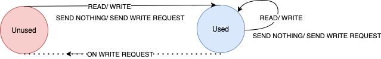

This is the continuation of [previous post](https://amutheezan.com/2021/06/04/murphi3.1-2.html) which provides remaining introduction to Murphi3.1.

In this post, I will go through some toy example using murphi3.1, based on what I have discussed in earlier posts.

### TOY-EXAMPLE - Simple File Management System

Define a File Management System, in simple form either multiple readers can read the file or only one writer can write the file.

 Consider there is only one file and 3 people have access to the file. Those three people can either ```Read``` or ```Write``` the file. We define this model by a simple Finite state machine.
Define States

1. ```Unused``` - No one uses the files
2.  ```SharUsed``` - File is read by one or more people
3. ```Modified``` - File is, or modified by one of the personpeople

Next we define, how the communication are happen,
The file (or data) in main-memory and it will loaded into virtual/private memory of individual users when they call a ```Read``` or ```Write``` command. The communication happen through a bus which connects all the users and main-memory and when ever some user send either  ```Read``` or ```Write``` command, it will communicate to the main memory and obtain the copy and use it. 

When ever one person tries to access 

Detailed State Diagram.




<!--stackedit_data:
eyJoaXN0b3J5IjpbODQ5NzAxOTg2LDIxMzUwNjc4NzcsMTc3Mj
E3MjU4MywyMDk5MDM5MDY2XX0=
-->