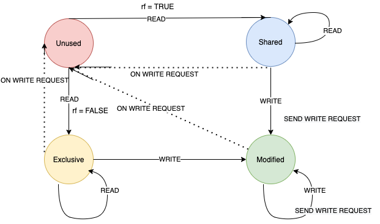

This is the continuation of [previous post](https://amutheezan.com/2021/06/04/murphi3.1-4.html) which provides a small extension to toy example in Murphi3.1.

In this post, I will go through full extension toy example using murphi3.1, based on what I have discussed in earlier posts.

### FULLY EXTENDED TOY-EXAMPLE - Simple File Management System

Define a File Management System, in simple form either multiple readers can read the file or only one writer can write the file. We define this model by a simple Finite state machine with following states,

1. ```Unused``` - No one uses the files
2.  ```Shared``` - File is read by more than persons
3. ```Exclusive``` - File is read by only one person
4. ```Modified``` - File is modified by one of the person

Next we define, how the communication are happen,
The file (or data) in main-memory and it will loaded into virtual/private memory of individual users when they call a ```Read``` or ```Write``` command. The communication happen through a bus which connects all the users and main-memory and when ever some user send either  ```Read``` or ```Write``` command, it will communicate to the main memory and obtain the copy and use it. 

Detailed State Diagram.



Now we look into how we simply convert this state diagram into murphi verification code.

Consider there is only one file and 3 people have access to the file. Those three people can either ```Read``` or ```Write``` the file. 

<!--stackedit_data:
eyJoaXN0b3J5IjpbNzM4MTIyNzI2LC0xODY1Nzg0NDYzXX0=
-->