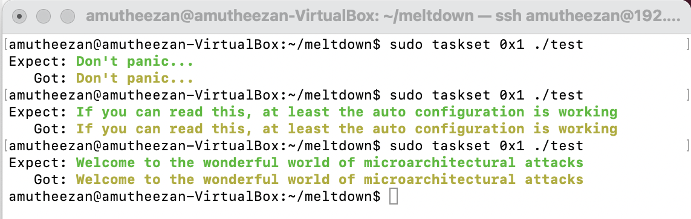
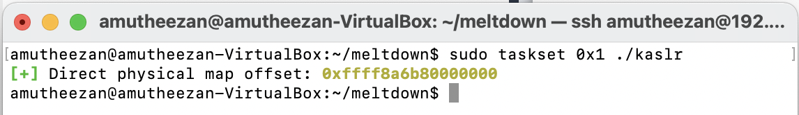
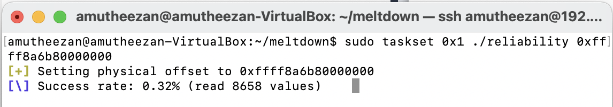
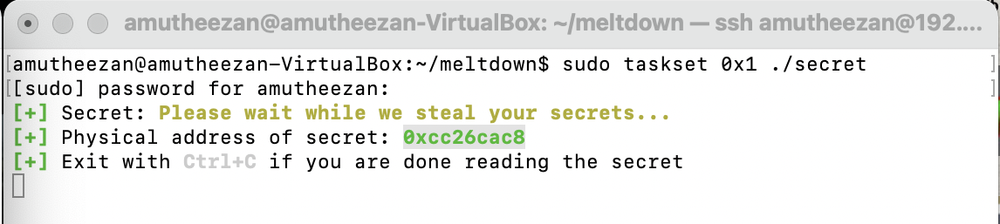
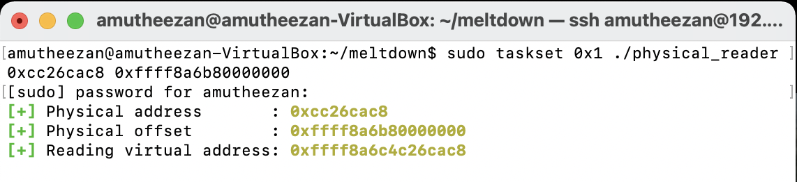
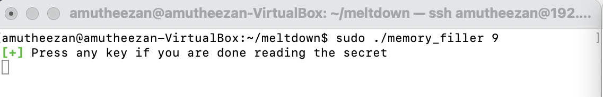
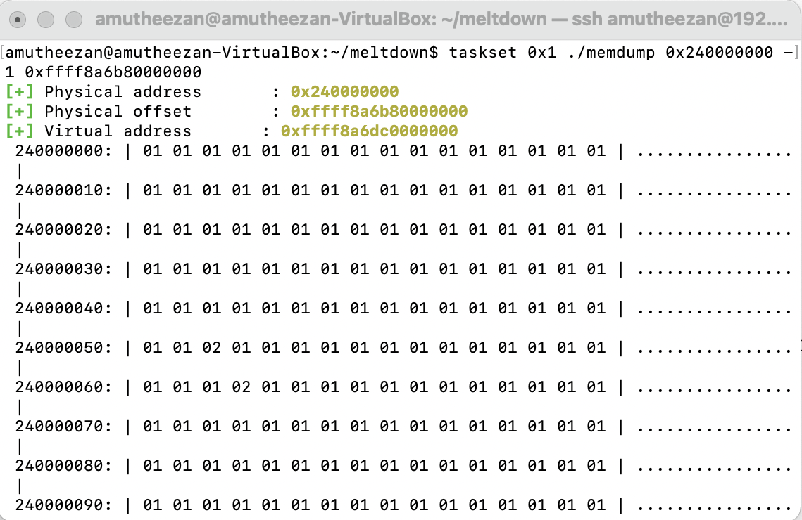

I have implemented a simple simulation for meltdown vulnerability as a part of assignment for **COSC 6385** course in University of Houston

## How Attack Works

Meltdown uses the race condition between memory access and privilege level checking while instruction is in processing. Meltdown attacks allow access to the parts of memory used by the operating systems or other running processes or recently used processes. Generally, one process is not permitted to access the memory of another running process. But in a meltdown attack, one process tries to access other process contents. Operating system(OS) has a permission setting, which will ensure that users are not allowed to access the kernel memory in user mode. And If a user tries to access the memory from kernel address space, it will result in a page fault. But due to the speculative execution and the process will execute some instruction ahead of page faulting instruction, they will roll back after the CPU has determined the permission setting. But these executions are still available in the cache, and attackers use various OS functionalities to dump these kinds of data from the cache. Based on this, the meltdown attack works [1](https://en.wikipedia.org/wiki/Kernel_page-table_isolation),[2](https://github.com/IAIK/meltdown/),[3](https://t.com/meltdow)

## DEMO

* Oracle Virtual Box : Version 6.1.18 r142142 (Qt5.6.3)
* Ubuntu 14.04.06 LTS
* Kernel Version: 4.4.0-142-generic

I first clone the meltdown demo repository [](https://github.com/IAIK/meltdown/) from GitHub and tried the following demonstration presents in the repository.

### Demonstrations of Meltdown Attack
* Demo \#01 - A first test (```test```)
* Demo \#02 - Breaking KASLR (```kaslr```)
* Demo \#03 - Reliability test (```reliability```)
*  Demo \#04 - Read physical memory (```hysical_reader```)
* Demo \#05 - Dump the memory (```memdump```)


#### Demo \#01 - A first test (```test```)

I have executed the basic test case for ```meltdown``` demos in this demo. I was able to get the same text in expect and got places. I also tried to call the same command, and it returns random texts in each run. (randomization of text happen based on the line 26 of ```test.c````

##### Commans

```bash
make;
sudo taskset 0x1 ./test
```

##### Screenshot




#### Demo \#02 - Breaking KASLR (```kaslr```)

This demo uses Meltdown to leak the secret randomization of the direct physical map. To get the offset quickly, we have to execute the commands with admin privileges. Note that I have used Ubuntu 14.04, which has the kernel 4.4.0-142 as disable ```aslr``` by default.

##### ommands

```bash
make;
sudo taskset 0x1 ./kaslr
```

##### Screenshot



#### Demo \#03 - Reliability test (```reliability```)

This demo tests how physical memory can be read. Note that I have used Ubuntu 14.04, which has kernel 4.4.0-142 as disable ```aslr``` by default. So I am technically not required to specify the offset value ```0xffff8a6b80000000```.

##### Commands

```bash
make;
sudo taskset 0x1 ./reliability 0xffff8a6b80000000
```
##### Screenshot



##### Issues aced
Unlike the demonstration shown in the GitHub repository [2](https://github.com/IAIK/\cite{meltdown/), I am unable to get higher reliability, and always I get reliability less than 1\%. I also tried similar commands with [Ubuntu 14.10]( \footnote{http://old-releases.ubuntu.com/releases/14.10/)  [```ubuntu-14.10-desktop-amd64.iso Last Modified: 2014-10-22 19:43```], but I faced the same issues in there as well.

#### Demo \#04 - Read physical memory (```hysical_reader```)

This demo reads memory from another process by directly reading physical memory. This demo contains two steps,

##### Steps and Commands

1. call ```secret``` with admin privileges and this will return the physical address of the test.
    
```bash
	sudo ./secret
```

2. call ```physical_reader``` with the specified physical address of secret text and offset.
    
```bash
    make;
    sudo taskset 0x1 ./physical_reader 0xcc26cac8 0xffff8a6b80000000
``` 

I have used Ubuntu 14.04, which has kernel 4.4.0-142 as disable kaslr by default. If kaslr is disabled, we can skip providing the offset parameter. So I don’t need to provide the offset value ```0xffff8a6b80000000```.


##### Screenshots




##### Issues Faced
Unlike the demonstration shown in the GitHub repository [2](https://github.com/IAIK/\cite{meltdown/), I am unable to get contents of secret. I also tried similar commands with Ubuntu 14.10, but I faced the same issues there as well.

#### Demo \#05 - Dump the memory (```memdump```)

This demo dumps the content of the memory. I set the memory size to 8GB as RAM for the virtual box. This demo contains two steps, 

##### Steps and Commands

1. call ```memory_filler``` with memory value specified to fill the memory. 
    
```bash
    sudo ./memory_filler 9
```

2.  call ```memdump``` to read the contents from memory.
    
```bash
    make;
    taskset 0x1 ./memdump 0x240000000 -1 0xffff8a6b80000000
```

##### Issues FacedUnlike the demonstration shown in the GitHub repository [2](https://github.com/IAIK/\cite{meltdown/), }, I am unable to get any meaningful human-readable data. I also tried similar commands with Ubuntu 14.10, but I faced the same issues there as well.

##### Screenshots




## How to Fix

### Software
For software level protection, we can use patches for Linux, Windows, and OS X.
Kernel page-table isolation (KPTI) (earlier referenced as KAISER) is a Linux kernel feature that protect the system from the Meltdown security vulnerability affecting mainly Intel's X86 CPU. It improves the kernel hardening against attempts to bypass the KSLR [1](https://en.wikipedia.org/wiki/Kernel_page-table_isolation),  [3](https://meltdownattack.com/meltdown.pdf).


### Hardware
For hardware level protection, we have to introduce a hard split between the user space and the kernel space. This can be enabled optionally by modern kernels using the newly introduce hard-split bit in the CPU control register (e.g. CR4). By setting the control bit the user space and kernel space can resides in different areas of address.
This hard-split can determine whether a memory fetch violates security boundary with the help virtual address. 

Note: Spectre attack simulation can be found in the [post](../_posts/spectre.md)

## REFERENCES
1. [https://en.wikipedia.org/wiki/Kernel_page-table_isolation](https://en.wikipedia.org/wiki/Kernel_page-table_isolation)
2. [https://github.com/IAIK/meltdown/](https://github.com/IAIK/meltdown/)
3.  [Meltdown Paper](https://meltdownattack.com/meltdown.pdf) 


<!--stackedit_data:
eyJoaXN0b3J5IjpbLTE1NzQwOTA4ODAsLTE1MjQ0NDUyMDEsNj
Q2NDk4NjQ0LDEzNTEwMTEzOCwtMjAyMzgxNTA2OSw0ODcxMTAx
ODQsMTE5MjI0NDc2LC0xMzM0NzU2NTMwLC0xNjIzMjkzOTA0XX
0=
-->
